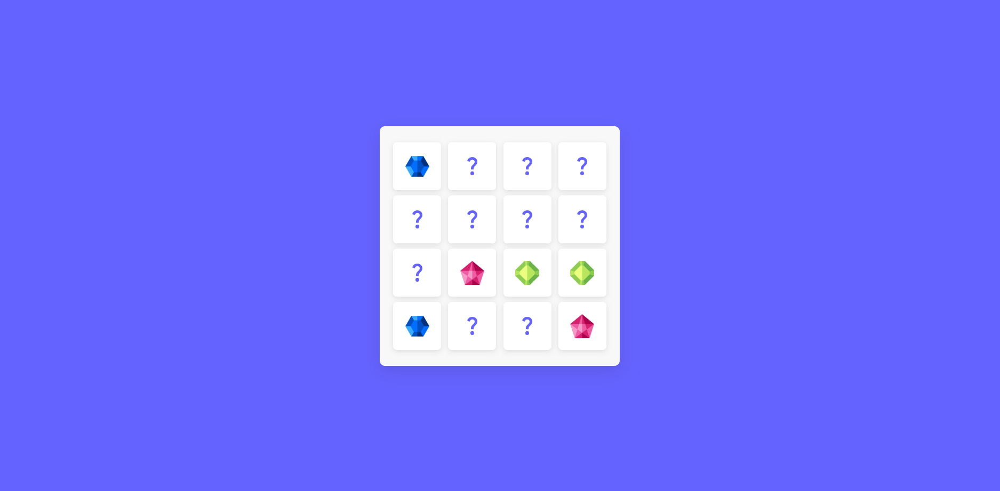

# 🃏 Kart Bulma Oyunu 🎮

Merhaba! 👋 Bu repo, eğlenceli bir **Kart Bulma Oyunu**'nun kodlarını içermektedir. Bu oyun, basit ama bağımlılık yapıcı bir hafıza geliştirme oyunudur! 🧠✨

## 📝 Oyun Hakkında

Bu oyunda, karışık kartlar arasında eşleşen çiftleri bulmaya çalışacaksınız. Her bir kartın arkasında bir sembol bulunmaktadır ve amacınız her kart çiftini en hızlı şekilde eşleştirmektir! ⏱️

## 🚀 Başlarken

### Gereksinimler:

- 🎮 HTML, CSS, ve JavaScript bilgisi (oyunu çalıştırmak için)
- 🌐 Bir tarayıcı (Chrome, Firefox, Safari vb.)

### Kurulum:

1. Bu repoyu bilgisayarınıza klonlayın:
   ```bash
   git clone https://github.com/SelimKse/Kart-Bulma-Oyunu.git
   ```
2. `index.html` dosyasını bir tarayıcıda açarak oyunu başlatın.

## 💡 Özellikler

- 🃏 Farklı zorluk seviyeleri
- 🧩 Renkli ve dikkat çekici kartlar

## 📷 Ekran Görüntüleri



## 🎯 Hedefler

- Kartları eşleştir ve en hızlı şekilde tamamla!

## 💬 Geri Bildirim

Oyunla ilgili her türlü geri bildirimi ve öneriyi bekliyorum! Eğer hata bulursanız, lütfen bir **issue** açın. 

## 👥 Katkıda Bulunma

Projeye katkı sağlamak isterseniz, lütfen aşağıdaki adımları takip edin:

1. Repoyu fork'layın.
2. Yeni bir dal oluşturun (`git checkout -b feature/özellik-adi`).
3. Değişikliklerinizi yapın ve commit edin (`git commit -am 'Yeni özellik eklendi'`).
4. Push yapın (`git push origin feature/özellik-adi`).
5. Pull request açın!

## 📜 Lisans

Bu proje MIT Lisansı altında lisanslanmıştır - detaylar için [LICENSE](LICENSE) dosyasına bakın.

---

İyi oyunlar! 🎉
